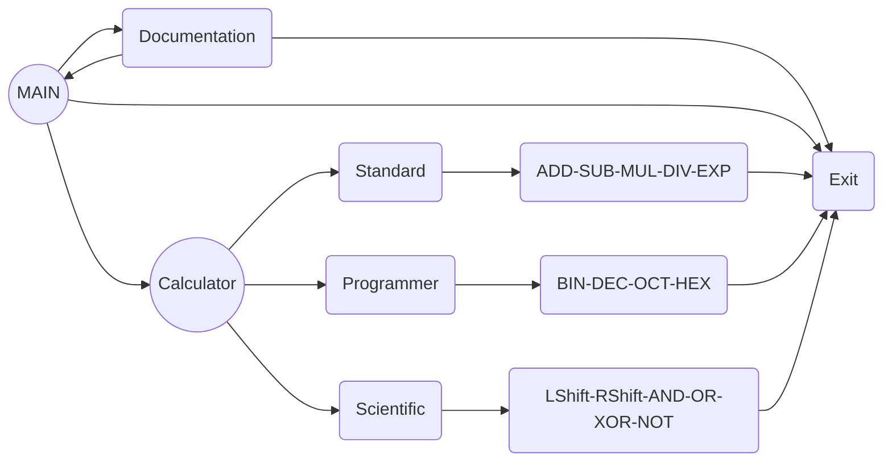

# Bash Shell Calculator

This is a simple calculator implemented in Bash. It is a practice project created as part of the Bash course provided by the Information Technology Institute (ITI).

## Features

- Addition (+): Adds two numbers.

- Subtraction (-): Subtracts one number from another.

- Division (/): Divides one number by another.

- Multiplication (*): Multiplies two numbers.

- Exponentiation (^): Raises a number to a specified power.

- Provides number conversion between different bases

   >  **Binary <-> Decimal <-> Octal <-> Hexadecimal**

## Code Flow

## Contributing
If you're a student or an aspiring coder, you are welcomed to contribute to my practice coding project. It's a great opportunity for practicing and honing your coding skills. Your contributions are highly appreciated and can have a positive impact on the project's growth.

## Contact
**Mohand Zaid** ` < mohandzaid33@gmail.com > `